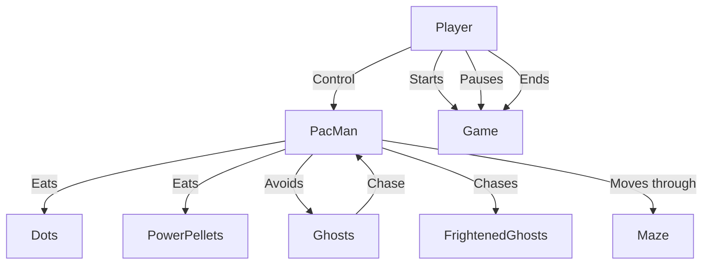
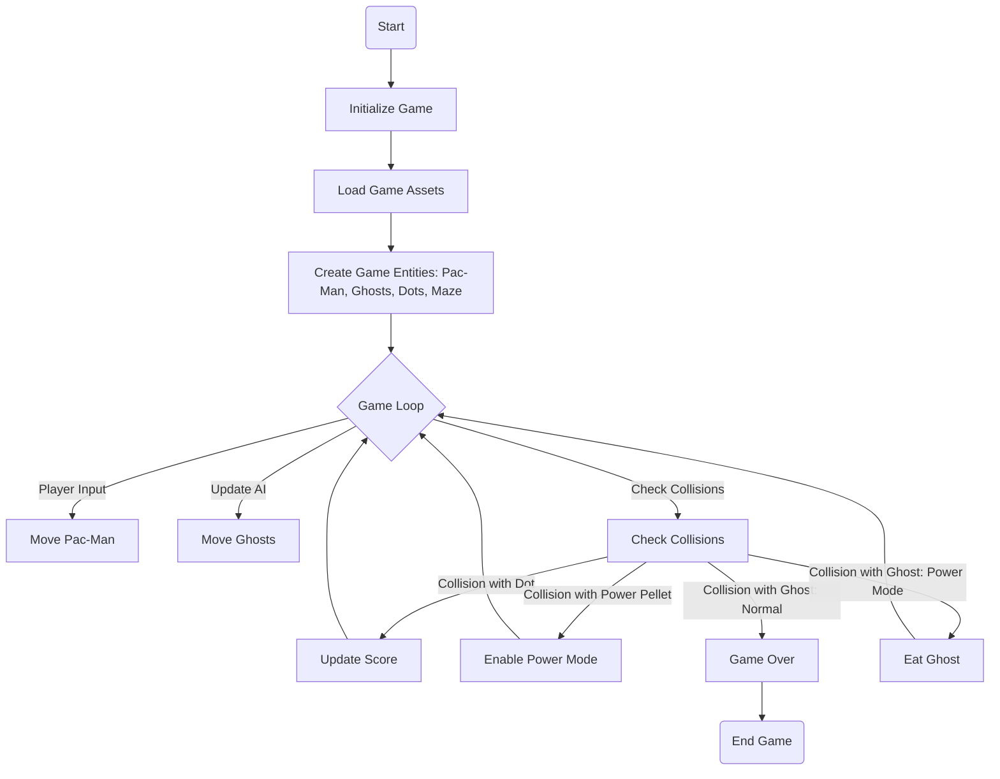

# CI/CD Game

Game made with Python and Pygame for CI/CD classes in University.

Team:
- [Roman Koshchei](https://github.com/roman-koshchei)
- [Bohdan Starosivets](https://github.com/sinarhen)
- [Rostyslav Derkach](https://github.com/rostiksqx)

## Analysis and Diagrams

We use Mermaid js to create and display diagrams. It's supported by GitHub as well. 

### Analysis of game

We looked up YouTube videos of original PacMan to see gameplay.
Here are things we need to implement:
- PacMan
  - Move
  - Eat points
  - Eat powerup
  - Eat ghosts 
- Ghosts
  - Following PacMan
  - Running away from PacMan
  - Comming back to base when eaten
- Game ending when all points or pacman are eaten

We plan to use DoD (data oriented design) to make game more performant and less complex. Not sure how much of DoD we will use.

### Use Case Diagram

### Activity Diagram

We aren't making class diagram, because the game development space is new for us.
We can't plan classes ahead, as well we use Data Oriented Design not pure OOP.