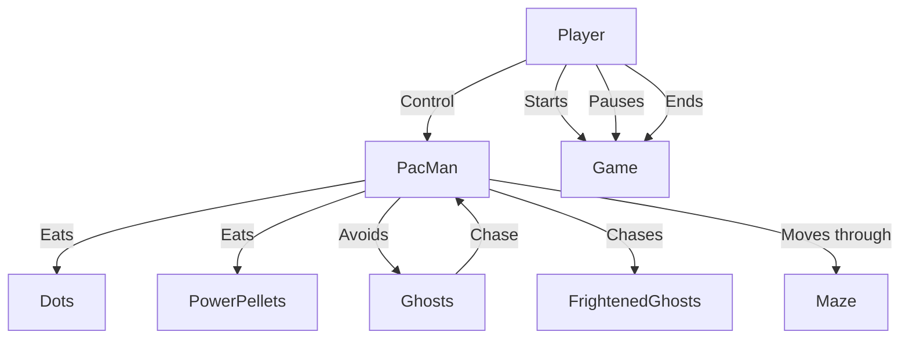

# CI/CD Game

Game made with Python and Pygame for CI/CD classes in University.

Team:
- [Roman Koshchei](https://github.com/roman-koshchei)
- [Bohdan Starosivets](https://github.com/sinarhen)
- [Rostyslav Derkach](https://github.com/rostiksqx)

## Diagrams

We use Mermaid js to create and display diagrams. It's supported by GitHub as well. 

### Use Case Diagram

